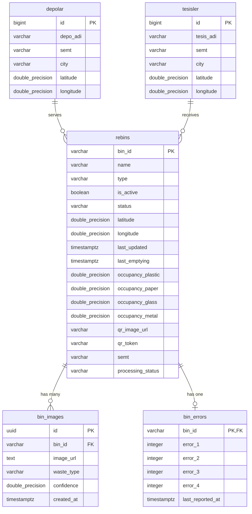

<<<<<<< HEAD
# REBİN (Recycling Bin Intelligent Network)
### Entegre Akıllı Atık Yönetim ve Döngüsel Ekonomi Ekosistemi

[](https://teknofest.org/)
[](#)
[](#)
[](https://opensource.org/licenses/MIT)

> **TEKNOFEST Sıfır Atık ve Döngüsel Ekonomi Yarışması** teknik şartnamesi, değerlendirme kriterleri ve jüri yönergelerine tam uyumlu olarak hazırlanmış sistem mimarisi, donanım tasarımı, veri modeli ve kurulum dokümantasyonudur.

---

## 📑 İçindekiler
1. [Proje Özeti ve Mimari Bakış](#1-proje-özeti-ve-mimari-bakış)
   - [Projenin Tanımı ve Kapsamı](#11-projenin-tanımı-ve-kapsamı)
   - [T.C. Sıfır Atık Standartları ve Renk Kodları](#12-tc-çevre-şehircilik-ve-iklim-değişikliği-bakanlığı-sıfır-atık-standartları)
   - [Uçtan Uca Sistem Mimarisi Şeması](#13-uçtan-uca-sistem-mimarisi-şeması)
2. [Sistem Bileşenleri ve Ekran Fonksiyonları](#2-sistem-bileşenleri-ve-ekran-fonksiyonları-kullanıcı-kılavuzu)
   - [A. Fiziksel Ünite & Donanım Servisi (Raspberry Pi 5 / Python)](#a-fiziksel-ünite--donanım-servisi-raspberry-pi-5--python)
   - [B. Web Yönetim Paneli (YonetimPage & Dashboard)](#b-web-yönetim-paneli-yonetimpage--dashboard)
   - [C. Mobil Uygulama (Saha Ekibi, Yönetici ve Vatandaş Arayüzü)](#c-mobil-uygulama-saha-ekibi-yönetici-ve-vatandaş-arayüzü)
3. [Veritabanı Tasarımı ve Veri Modeli](#3-veritabanı-tasarımı-ve-veri-modeli-database-schema)
   - [İlişkisel Veritabanı Tabloları](#31-ilişkisel-veritabanı-tabloları-supabase-postgresql)
   - [SQL Tetikleyicileri (Triggers) ve Güvenlik Mekanizmaları](#32-sql-tetikleyicileri-triggers-ve-güvenlik-mekanizmaları)
   - [Storage ve Satır Düzeyi Güvenlik (RLS) Politikaları](#33-storage-ve-satır-düzeyi-güvenlik-rls-politikaları)
4. [Kamu Sistemleri ve REST/OGC API Entegrasyon Potansiyeli](#4-kamu-sistemleri-ve-restogc-api-entegrasyon-potansiyeli)
   - [Açık Standartlar ve Veri Formatları](#41-açık-standartlar-ve-veri-formatları)
   - [CBS/GIS ve SABS (Sıfır Atık Bilgi Sistemi) Entegrasyonu](#42-cbsgis-ve-sabs-sıfır-atık-bilgi-sistemi-entegrasyonu)
5. [Kurulum ve Çalıştırma Rehberi](#5-kurulum-ve-çalıştırma-rehberi-installation-guide)
   - [A. Donanım Servisi Kurulumu (Raspberry Pi 5)](#a-donanım-servisi-kurulumu-raspberry-pi-5)
   - [B. Web Yönetim Paneli Kurulumu](#b-web-yönetim-paneli-kurulumu-react--vite)
   - [C. Mobil Uygulama Kurulumu](#c-mobil-uygulama-kurulumu-flutter)
6. [Kütüphaneler ve Lisanslar](#6-kütüphaneler-ve-lisanslar-dependencies--licensing)
=======
# Rebin - Entegre Akıllı Atık Yönetim Sistemi

[](LICENSE)
[](https://react.dev/)
[](https://vitejs.dev/)
[](https://supabase.com/)
[](https://www.python.org/)
[](https://www.raspberrypi.com/)
[](#12-sıfır-atık-standartları-ve-renk-kodları)

---

## İçindekiler
1. [Proje Özeti ve Mimari Bakış](#1-proje-özeti-ve-mimari-bakış)
   - [Projenin Tanımı](#11-projenin-tanımı)
   - [Sıfır Atık Standartları ve Renk Kodları](#12-sıfır-atık-standartları-ve-renk-kodları)
   - [Sistem Mimarisi Şeması](#13-sistem-mimarisi-şeması)
2. [Sistem Bileşenleri ve Ekran Fonksiyonları (Kullanıcı Kılavuzu)](#2-sistem-bileşenleri-ve-ekran-fonksiyonları-kullanıcı-kılavuzu)
   - [A. Fiziksel Ünite & Donanım Servisi (Raspberry Pi 5 / Python)](#a-fiziksel-ünite--donanım-servisi-raspberry-pi-5--python)
   - [B. Web Yönetim Paneli (YonetimPage & Harita & Kutular)](#b-web-yönetim-paneli-dashboard--yonetimpage)
   - [C. Mobil Saha & Yönetici Arayüzü](#c-mobil-saha--yönetici-arayüzü)
3. [Veritabanı Tasarımı ve Veri Modeli (Database Schema)](#3-veritabanı-tasarımı-ve-veri-modeli-database-schema)
   - [Varlık-İlişki ve Tablo Yapısı](#31-tablo-yapıları-ve-alan-tanımları)
   - [İş Mantığı ve Güvenlik Kuralları (Triggers & Functions)](#32-aktif-sql-tetikleyicileri-triggers)
   - [Storage ve RLS Güvenlik Politikaları](#33-depolama-storage-ve-rls-politikaları)
4. [Kamu Sistemleri ve REST/OGC API Entegrasyon Potansiyeli](#4-kamu-sistemleri-ve-restogc-api-entegrasyon-potansiyeli)
   - [Açık Standartlar ve Veri Formatları](#41-açık-standartlar-ve-veri-biçimleri)
   - [Belediye CBS ve Sıfır Atık Bilgi Sistemi (SABS) Entegrasyonu](#42-belediye-cbsgis-ve-sabs-entegrasyonu)
5. [Kurulum ve Çalıştırma Rehberi (Installation Guide)](#5-kurulum-ve-çalıştırma-rehberi-installation-guide)
   - [A. Donanım Servisi Kurulumu (Raspberry Pi)](#a-donanım-servisi-kurulumu-raspberry-pi-5)
   - [B. Web Yönetim Paneli Kurulumu](#b-web-yönetim-paneli-kurulumu)
6. [Kütüphaneler ve Lisanslar (Dependencies & Licensing)](#6-kütüphaneler-ve-lisanslar-dependencies--licensing)
>>>>>>> 80710bb46569c173ee2f316340e5de91f509a0a8
7. [Demo Videosu ve Teknik Doküman Linkleri](#7-demo-videosu-ve-teknik-doküman-linkleri)

---

<<<<<<< HEAD
## 1. PROJE ÖZETİ VE MİMARİ BAKIŞ

### 1.1. Projenin Tanımı ve Kapsamı
**REBİN**, evsel ve kamusal alanlardaki geri dönüşüm sürecini yapay zeka, uç bilişim (Edge AI) ve nesnelerin interneti (IoT) ile optimize eden **yeni nesil akıllı atık ayrıştırma ve lojistik yönetim ekosistemidir**. 

Geleneksel geri dönüşüm konteynerlerinde yaşanan çapraz kontaminasyon (farklı atıkların birbirine karışarak geri dönüştürülebilirliği yok etmesi), rotasız çöp kamyonlarının yarattığı gereksiz karbon emisyonu ve vatandaş katılımı eksikliği sorunlarını çözmek amacıyla geliştirilmiştir.

Sistem 3 temel ayaktan meydana gelir:
1. **Fiziksel Akıllı Ünite (Edge AI Node):** Raspberry Pi 5 donanımı üzerinde koşan OpenCV ve optimize YOLOv8n çıkarım motoru ile atığı giriş anında milisaniyeler içinde sınıflandırır, mekanik servo/step motor kapak mekanizmasıyla doğru hazneye sevk eder.
2. **Merkezi Bulut & Veri Tabanı (Supabase Realtime & Storage):** Sensör doluluk oranlarını, arıza loglarını, yüksek çözünürlüklü doğrulama fotoğraflarını ve filo konumlarını milisaniyelik gecikmeyle depolar ve dağıtır.
3. **Çok Platformlu Kontrol Arayüzleri:** 
   - **Web Yönetim Paneli:** Şehir/ilçe ölçeğinde canlı doluluk izleme, filo takip radarı, arıza bildirimleri ve atık tesisi yönlendirmeleri.
   - **Mobil Uygulama (Flutter):** Saha toplama personeli için eniyilenmiş rotalama; vatandaşlar için on-device AI malzeme tanıma, QR kodlu kilit açma ve ödüllendirici çevre oyunlaştırması.

---

### 1.2. T.C. Çevre, Şehircilik ve İklim Değişikliği Bakanlığı Sıfır Atık Standartları
Proje, Sıfır Atık Yönetmeliği’nde belirtilen renk ve piktogram standartlarına %100 uyumlu olarak tasarlanmıştır. Proje genelindeki UI bileşenleri, fiziksel kapaklar ve grafik göstergeleri aşağıdaki resmi renk paletini uygular:

| Atık Kategorisi | Resmi Renk Kodu | İkincil Yumuşak Zemin | Piktogram & Standart Açıklama |
| :--- | :--- | :--- | :--- |
| **Plastik Atıklar** | `#1477d4` / `#1565C0` *(Mavi)* | `#EBF3FA` *(Açık Buz Mavisi)* | PET şişeler, PE/PP ambalajlar, şeffaf plastikler |
| **Kağıt & Karton** | `#feb200` / `#FBC02D` *(Sarı / Sıcak Altın)* | `#FFFDE7` *(Açık Sarı)* | Gazete, mukavva koli, temiz ambalaj kağıtları |
| **Cam Atıklar** | `#41a047` / `#388E3C` *(Yeşil)* | `#E8F5E9` *(Açık Nane Yeşili)* | Şişe, kavanoz, renksiz/renkli cam ambalaj |
| **Metal Atıklar** | `#ef524e` / `#E53935` *(Kırmızı)* | `#FFEBEE` *(Açık Pembe / Kırmızı)* | Alüminyum içecek kutuları, konserve, metal kapaklar |

---

### 1.3. Uçtan Uca Sistem Mimarisi Şeması

```mermaid
flowchart TB
    subgraph EDGE_LAYER["1. Fiziksel Ünite & Uç Bilişim (Raspberry Pi 5)"]
        Sensors["Ultrasonik Mesafe & Ağırlık Sensörleri"]
        Cam["Geniş Açı Kamera Modülü (CSI/USB)"]
        YOLO["YOLOv8n / PyTorch Inference (640x640)"]
        Motors["GPIO Kontrolör & Ayrıştırma Mekanizması"]
        Watchdog["Watchdog Servisi & Heartbeat Daemon"]
    end

    subgraph CLOUD_LAYER["2. Bulut Altyapısı & Veri Katmanı (Supabase / PostgreSQL)"]
        Auth["Supabase Auth (Anon & Token Doğrulama)"]
        Storage["Storage Bucket (REBIN-IMAGES)"]
        DB[(PostgreSQL)]
        Realtime["Realtime WebSocket Engine"]
        Triggers["SQL Triggers (Anti-False Peak & Auto Out-of-Order)"]
    end

    subgraph WEB_DASHBOARD["3. Web Yönetim Paneli (React + Vite + Leaflet)"]
        LiveState["Canlı Akış & 10s Geri Sayım"]
        FilterEngine["İl / İlçe Bölgesel Filtreleme"]
        MapGIS["CBS Harita (Depolar & Geri Dönüşüm Tesisleri)"]
        FleetTrack["Sağ Alt Canlı Filo & Kamyon Takip Widget'ı"]
        AlertPanel["Sarı Temalı Arıza & Kapasite Paneli"]
    end

    subgraph MOBILE_APP["4. Mobil Uygulama (Flutter iOS & Android)"]
        OnDeviceAI["On-Device AI Çıkarım (TFLite / PyTorch Mobile)"]
        QRScanner["AES-256 / QR Doğrulama (qr_token)"]
        OfflineSync["SQLite / SQFlite Çevrimdışı Katman"]
        OSM_Routing["OpenStreetMap & Overpass QL Rota Servisi"]
        Gamification["Görevler, Bilgi Kartları & Karbon İstatistiği"]
    end

    %% İlişkiler
    Cam --> YOLO
    YOLO --> Motors
    Sensors --> Watchdog
    YOLO --> Watchdog
    Watchdog -- "Görüntü Yükleme" --> Storage
    Watchdog -- "Telemetri, Durum, Hata" --> DB
    DB --> Triggers
    DB --> Realtime

    Realtime --> LiveState
    DB --> FilterEngine
    DB --> MapGIS
    Realtime --> AlertPanel
    DB --> FleetTrack

    Realtime --> OSM_Routing
    Storage --> OnDeviceAI
    DB --> QRScanner
    QRScanner --> OfflineSync
    Realtime --> Gamification
=======
## 1. Proje Özeti ve Mimari Bakış

### 1.1 Projenin Tanımı
**Rebin**, kentsel ve kurumsal alanlarda geri dönüşüm verimliliğini maksimize etmek amacıyla geliştirilmiş uçtan uca **Entegre Akıllı Atık Yönetim Sistemidir**. Sistem; **Raspberry Pi 5** tabanlı fiziksel akıllı atık ayrıştırma ünitesi, derin öğrenme tabanlı kamera görüntü işleme servisi, **Supabase PostgreSQL** bulut omurgası, **OSRM / Held-Karp / 2-Opt** algoritmalarıyla donatılmış dinamik rota optimizasyonlu web kontrol merkezi ve saha ekipleri için geliştirilmiş mobil arayüzlerden oluşur.

Rebin; atığı kaynağında türüne göre (Plastik, Kağıt, Cam, Metal) otonom olarak sınıflandırır, mekanik kapak mekanizmasıyla doğru hazneye yönlendirir, doluluk verilerini anlık olarak buluta işler ve lojistik araç filosunun karbon ayak izini en aza indirecek dinamik toplama rotaları üretir.

---

### 1.2 Sıfır Atık Standartları ve Renk Kodları
Rebin, **T.C. Çevre, Şehircilik ve İklim Değişikliği Bakanlığı Sıfır Atık Yönetmeliği**'nde belirtilen standart atık piktogramları ve renk hiyerarşisiyle tam uyumlu çalışır. Proje arayüzlerinde ve fiziksel ünite yönlendirmelerinde kullanılan renk kodları:

| Atık Kategorisi | Resmi Renk Kodu | İkincil Zemin Tonu | Kullanım Alanı |
| :--- | :--- | :--- | :--- |
| **Plastik Atıklar** | `#1477D4` (Mavi) | `#EBF3FA` (Açık Mavi) | Plastik dairesel grafik, ikon ve hazne kartı |
| **Kağıt Atıklar** | `#FEB200` (Sarı / Turuncu) | `#FFFDE7` (Açık Sarı) | Kağıt dairesel grafik, ikon ve hazne kartı |
| **Cam Atıklar** | `#41A047` (Canlı Yeşil) | `#E8F5E9` (Açık Yeşil) | Cam dairesel grafik, buton ve hazne kartı |
| **Metal Atıklar** | `#EF524E` (Kırmızı / Pembe) | `#FFEBEE` (Açık Pembe) | Metal dairesel grafik, ikon ve hazne kartı |

---

### 1.3 Sistem Mimarisi Şeması

```mermaid
flowchart TB
    subgraph Hardware["1. Fiziksel Ünite (Raspberry Pi 5)"]
        Cam["Kamera Modülü (HQ Camera)"]
        Sensors["Sensörler (Doluluk / Ağırlık / ToF)"]
        Actuators["Servo & Step Motorlar (Ayrıştırma Kapağı)"]
        PiCore["Pi 5 Edge Controller"]
        Cam --> PiCore
        Sensors --> PiCore
        PiCore --> Actuators
    end

    subgraph EdgeService["2. Python Kamera & Donanım Servisi"]
        CV["OpenCV & YOLOv8/v11 Sınıflandırma"]
        Watchdog["Watchdog Klasör İzleme"]
        Heartbeat["Donanım Sağlık & Arıza Takibi (Heartbeat)"]
        PiCore --> CV
        CV --> Watchdog
        PiCore --> Heartbeat
    end

    subgraph Cloud["3. Supabase Bulut Altyapısı"]
        Storage[("Storage Bucket: REBIN-IMAGES")]
        Postgres[("PostgreSQL Veritabanı")]
        Realtime["Realtime Engine (Canlı Yayın & Abonelik)"]
        Triggers["SQL Triggers (Kapasite Limiti & Arıza Tespiti)"]
        
        Watchdog -->|Görsel Upload| Storage
        Watchdog -->|Metadata & Sonuç| Postgres
        Heartbeat -->|Hata Kaydı| Postgres
        Postgres --- Triggers
        Postgres --- Realtime
    end

    subgraph ClientLayers["4. Kullanıcı & Operasyon Arayüzleri"]
        WebAdmin["Web Yönetim Paneli (React 19 + Vite + Leaflet)"]
        RouteOpt["OSRM / Held-Karp / 2-Opt Rota Motoru"]
        MobileApp["Mobil Saha Ekibi Arayüzü (Sürücü Navigasyonu)"]
        MunicipalCBS["Belediye CBS / SABS REST API Entegrasyonu"]

        Realtime -->|WebSocket Akışı| WebAdmin
        Realtime -->|WebSocket Akışı| MobileApp
        Postgres -->|REST / PostgREST| RouteOpt
        Postgres -->|REST / GeoJSON| MunicipalCBS
    end
```

```text
+---------------------------------------------------------------------------------------+
|                                REBIN SISTEM MIMARISI                                  |
+---------------------------------------------------------------------------------------+
|  [Fiziksel Kutu: RPi 5]  -->  [YOLO & OpenCV]  -->  [Watchdog & Supabase-Py]         |
|             |                                                |                        |
|    Sensör & Step Motor                               Görsel & Doluluk Verisi          |
|             |                                                v                        |
|             +-------------------------------------> [Supabase Bulut]                  |
|                                                     - PostgreSQL (rebins, bin_errors) |
|                                                     - Realtime WebSocket              |
|                                                     - Storage (REBIN-IMAGES)          |
|                                                              |                        |
|       +------------------------------------------------------+                        |
|       |                                                      |                        |
|       v                                                      v                        |
|  [Web Dashboard (React 19)]                           [Mobil Saha Arayüzü]            |
|  - Canlı 3 Aşamalı Akış                               - Dinamik Rota Takibi           |
|  - Depolar / Tesisler Haritası                        - QR Kod Doğrulama              |
|  - Sağ Alt Filo Takip Konsolu                         - Saha Arıza Bildirimi          |
|  - Held-Karp Rota Optimizasyonu                       - Güvenli %10 Filtresi          |
+---------------------------------------------------------------------------------------+
>>>>>>> 80710bb46569c173ee2f316340e5de91f509a0a8
```

---

<<<<<<< HEAD
## 2. SİSTEM BİLEŞENLERİ VE EKRAN FONKSİYONLARI (Kullanıcı Kılavuzu)

### A. Fiziksel Ünite & Donanım Servisi (Raspberry Pi 5 / Python)
Fiziksel REBİN istasyonu, harici bir bilgisayara ihtiyaç duymadan otonom olarak çalışır:
* **OpenCV & YOLOv8 Tabanlı Anlık Sınıflandırma:** Atık hazneye bırakıldığında tetiklenen optik sensör, kamera görüntüsünü alır. 640x640 piksele ölçeklenen tensör, YOLOv8n derin öğrenme modelinden geçirilerek atığın türü (`Plastik`, `Kağıt`, `Cam`, `Metal`, `Çöp`) ve doğruluk skoru (confidence score) saniyeden kısa bir sürede tespit edilir.
* **GPIO Mekatronik Ayrıştırma:** Belirlenen sınıfa göre Raspberry Pi 5'in 40 pinli GPIO portu üzerinden yönlendirici servo motorlara sinyal gönderilir. Mekanik kapak doğru atık haznesine açılarak atığın doğru bölmeye düşmesi sağlanır.
* **Watchdog Yerel Klasör İzleme & Supabase Storage Entegrasyonu:** Taranan her atığın anlık fotoğrafı yerel bellekte (`/tmp/rebin_captures`) saklanır. `watchdog.observers` servisi yeni görsel tespit ettiği anda görseli Supabase `REBIN-IMAGES` bulut bucket'ına yükler ve URL'sini veritabanındaki `bin_images` tablosuna işler.
* **Donanım Sağlık Kontrolü (Heartbeat) & Otomatik Arıza Loglama:** Ünite üzerindeki sensörler (kamera bağlantısı, mesafe sensörleri, motor sürücüsü) periyodik olarak donanımsal sorgudan (ping) geçer. Arıza durumunda sistem otomatik olarak `bin_errors` tablosuna log bırakır ve kutunun durumunu `out_of_order` (arızalı) moduna alarak fiziksel kapağı kilitler.

---

### B. Web Yönetim Paneli (YonetimPage & Dashboard)
Belediye yetkilileri, atık yönetim şirketleri ve tesis müdürleri için geliştirilen web arayüzüdür:
* **Canlı Durum Akış Motoru (State Engine):** 
  - `Waiting (Bekleme)`: Kutu boştadır, kullanıcı etkileşimi beklenir.
  - `Processing (Sınıflandırma)`: Atık hazneye atılmıştır; ekranda dinamik CSS Spin animasyonu döner.
  - `Result (Sonuç Ekranı)`: Modelin tespit ettiği sınıf, çekilen fotoğraf ve % doğruluk oranı gösterilir. Ekranda **10 saniyelik dairesel SVG geri sayım barı** çalışır; süre bitiminde panel otomatik olarak bekleme moduna döner.
* **İnteraktif CBS Harita Entegrasyonu (`react-leaflet`):**
  - **Depolar (Mavi İşaretçi):** Şehir genelindeki atık toplama ve ara transfer istasyonları.
  - **Tesisler (Yeşil İşaretçi):** Geri kazanım ve bertaraf fabrikaları. Koordinat bazlı (WGS84 Lat/Lon) akıllı harita üzerinden tüm noktalar anlık tıklanabilir ve doluluk oranları filtrelenebilir.
* **Bölgesel Hiyerarşik Filtreleme:** Şehir bazında (**Ankara**, **İstanbul**) ve ilçe/semt bazında (Çankaya, Yenimahalle, Kadıköy, Beşiktaş vb.) anlık filtreleme.
* **Sağ Alt Filo Takip & Kontrol Widget'ı:** Ekranın sağ alt köşesine sabitlenmiş canlı radar penceresi. Sahada dolaşan toplama kamyonlarının anlık GPS konumlarını, plaka numaralarını ve kalan rota mesafelerini gösterir.
* **Arıza & Kapasite Güvenlik Paneli:** Sensör hatası alan veya aşırı dolan kutular Sarı Vurgulu **"ARIZALI!"** ve **"KRİTİK KAPASİTE"** rozetleriyle listelenir; operatöre tek tıkla saha ekibi görevlendirme imkanı tanır.

---

### C. Mobil Uygulama (Saha Ekibi, Yönetici ve Vatandaş Arayüzü)
Flutter tabanlı mobil uygulama, saha lojistik personeli ve vatandaşlar için hibrit yetenekler sunar:
* **Bölge Bazlı Toplama Rotası & Dinamik Coğrafi Zeka:** `OverpassService` üzerinden OpenStreetMap sunucularına doğrudan Overpass QL sorguları iletilir:
  `node["amenity"="recycling"](around:3000, lat, lon)`
  Kullanıcının ve aracın 3 km çevresindeki en optimize toplama rotası Haversine algoritmasıyla harita katmanında (`flutter_map`) çizilir.
* **Güvenli Doluluk Oranları & Tahmin Grafikleri:** `%10 filtreli` kararlı veri yapısıyla anlık doluluk oranları takip edilir. `fl_chart` kullanılarak kutunun son 7 günlük dolum hızı ve boşaltım tahmini eğrisi çıkarılır.
* **On-Device AI Tarama (İnternetsiz Tanıma):** Mobil kameradan alınan YUV görüntüleri RGB Float32'ye normalize edilerek yerel TFLite/PyTorch Mobile modelinde işlenir. Bounding Box'lar Flutter Canvas katmanında `CustomPainter` ile çizilir.
* **AES-256 / QR Doğrulama (`qr_token`):** Kutunun üzerindeki dinamik QR kod mobil uygulama ile okutularak kutu mülkiyeti ve işlem oturumu doğrulanır; sahte atık girişleri imkansız hale getirilir.
* **Sosyal Etki ve Döngüsel Oyunlaştırma:** "50 Plastik Şişe Tara", "100 Cam Kavanoz Ayrıştır" gibi günlük/haftalık görevler, bilgi kartları (swipeable flashcards) ve kullanıcıya kazandırdığı su/karbon tasarruf metrikleri.

---

## 3. VERİTABANI TASARIMI VE VERİ MODELİ (Database Schema)

### 3.1. İlişkisel Veritabanı Tabloları (Supabase PostgreSQL)

#### 1. `rebins` Tablosu (Ana Kutu Envanteri ve Telemetri)
```sql
CREATE TABLE public.rebins (
    bin_id TEXT PRIMARY KEY,
    name TEXT NOT NULL,
    is_active BOOLEAN DEFAULT true,
    status TEXT DEFAULT 'active' CHECK (status IN ('active', 'out_of_order', 'maintenance')),
    type TEXT DEFAULT 'public' CHECK (type IN ('public', 'private')),
=======
## 2. Sistem Bileşenleri ve Ekran Fonksiyonları (Kullanıcı Kılavuzu)

### A. Fiziksel Ünite & Donanım Servisi (Raspberry Pi 5 / Python)
Fiziksel ünite, atığın atıldığı andan itibaren ayrıştırılıp güvenli veriye dönüştürülmesini sağlayan otonom donanım katmanıdır:

1. **OpenCV & YOLO Tabanlı Anlık Atık Sınıflandırma:**
   - Kutu giriş haznesine yerleştirilen optik sensör tetiklendiğinde yüksek çözünürlüklü kamera ile atık görüntüsü kaydedilir.
   - Eğitilmiş nesne tespit modeli (YOLO) görüntüyü analiz ederek atığı 4 sınıftan birine (`plastic`, `paper`, `glass`, `metal`) sınıflandırır ve güven skoru (`confidence: 0.0 - 1.0`) üretir.
2. **GPIO Motor & Mekanik Kapak Kontrolü:**
   - Model çıktısına göre Raspberry Pi GPIO pinleri üzerinden servo veya step motorlar tetiklenir.
   - Döner mekanik kanal veya flap sistemi atığı doğru hazneye yönlendirir.
3. **Watchdog Yerel Klasör İzleme & Supabase Storage Senkronizasyonu:**
   - `watchdog` kütüphanesi yerel depolama alanını milisaniyelik gecikmeyle dinler.
   - Yeni yakalanan atık fotoğrafı asenkron olarak Supabase Storage (`REBIN-IMAGES`) kovasına yüklenir; dönen public URL ve sınıflandırma metadataları `bin_images` tablosuna INSERT edilir.
4. **Donanım Sağlık Kontrolü (Heartbeat) & Arıza Kaydı:**
   - Belirli aralıklarla sensör yanıtları, motor durumları ve bağlantı kalitesi kontrol edilir (Daemon Heartbeat).
   - Mekanik sıkışma, sensör arızası veya optik kirlilik saptandığında otomatik olarak `bin_errors` tablosundaki ilgili sayaca (`error_1` - `error_4`) kayıt düşülür.

---

### B. Web Yönetim Paneli (Dashboard & YonetimPage)
Yöneticiler ve belediye operasyon ekipleri için hazırlanan web kontrol merkezi aşağıdaki kritik fonksiyonları barındırır:

1. **Canlı Durum Akışı (Realtime State Stream):**
   - **Bekleme (Waiting):** Kutu boşta ve yeni atık bekliyor durumundayken şık bir bekleme göstergesi sunar.
   - **Sınıflandırma Bekleniyor (Processing - CSS Spin):** Atık algılandığında ve yapay zeka çıkarımı sürerken akıcı CSS animasyonlu spin göstergesi ile sistemin çalıştığı kullanıcıya bildirilir.
   - **Sonuç Ekranı (Result):** Çıkarım tamamlandığında 10 saniyelik dairesel geri sayım başlar. Bu ekranda çekilen güncel atık fotoğrafı, tespit edilen kategori rozeti ve doğruluk oranı (`% Güven Skoru`) canlı olarak sergilenir.
2. **İnteraktif Harita & Tesis Entegrasyonu (`HaritaPage` & `YonetimPage`):**
   - **Depolar:** Supabase `depolar` tablosundan canlı çekilen lojistik kalkış noktaları mavi işaretçilerle (`#2563EB`) gösterilir.
   - **Tesisler:** `tesisler` tablosundan çekilen ana geri dönüşüm merkezleri yeşil işaretçilerle (`#7C3AED` / `#9333EA` / `#388E3C`) haritada konumlandırılır.
   - **Kutular:** Kutuların anlık doluluk durumlarına göre dinamik piktogramlar ve arıza bayrakları harita üzerinde render edilir.
3. **Bölgesel ve Semt Bazlı Filtreleme:**
   - Şehir bazında hızlı odaklanma (**İstanbul** / **Ankara** merkez koordinatları ve zoom düzeyleri).
   - Veritabanındaki `semt` kolonundan dinamik üretilen semt filtreleme menüsü sayesinde hedeflenen mahalle ve bölgeler anında süzülebilir.
4. **Filo Takip & Kontrol Paneli (Sağ Alt Widget):**
   - Yönetim sayfasının sağ alt köşesine sabitlenmiş, katlanabilir (minimize/maximize) bağımsız filo izleme konsolu.
   - OSRM matrisi ve Held-Karp / 2-Opt algoritmalarıyla optimize edilen araçların anlık harita üzerindeki hareketleri, kalan mesafe, tahmini varış süresi ve taşıma durumu bu konsoldan yönetilir.
5. **Arıza & Kapasite Yönetimi:**
   - Arıza bildirim sayacı pozitif olan kutular için sarı/kehribar temalı belirgin **"ARIZALI!"** uyarı kartı açılır.
   - Yönetici tek tıkla **"İlgili Birimi Görevlendir"** butonuna basarak arıza durumunu sıfırlayabilir ve saha ekiplerine bildirim yönlendirebilir.

---

### C. Mobil Saha & Yönetici Arayüzü
Saha toplama personeli ve şoförlerin kullandığı mobil arayüz:

1. **Bölge Bazlı Optimize Toplama Rotası:**
   - Şoförün bulunduğu depodan başlayan, kritik doluluktaki kutuları en kısa sürede toplayıp en yakın geri dönüşüm tesisine ulaştıran adım adım rota navigasyonu.
2. **Güvenli Doluluk Oranları (%10 Filtreli Veri):**
   - Hatalı ölçüm ve dik düşen atık dalgalanmalarından arındırılmış, veritabanı trigger korumalı net hacim oranları.
3. **Kutu QR Kod Doğrulama:**
   - Saha personeli kutu yanına vardığında kutu üzerindeki dinamik QR kodu taratarak boşaltım işlemini onaylar ve doluluk oranını sıfırlar.

---

## 3. Veritabanı Tasarımı ve Veri Modeli (Database Schema)

Sistem, **Supabase PostgreSQL** üzerinde ilişkisel veri bütünlüğü, row-level security (RLS) ve özel veritabanı tetikleyicileri ile kurgulanmıştır.



---

### 3.1 Tablo Yapıları ve Alan Tanımları

#### 1. `rebins` Tablosu (Ana Kutu Varlığı)
Akıllı kutuların operasyonel durumunu, anlık doluluklarını ve koordinatlarını tutar.
```sql
CREATE TABLE public.rebins (
    bin_id VARCHAR(64) PRIMARY KEY,
    name VARCHAR(128) NOT NULL,
    type VARCHAR(32) DEFAULT 'public', -- 'public' veya 'private'
    is_active BOOLEAN DEFAULT true,
    status VARCHAR(32) DEFAULT 'active', -- 'active', 'out_of_order'
    latitude DOUBLE PRECISION NOT NULL,
    longitude DOUBLE PRECISION NOT NULL,
    last_updated TIMESTAMPTZ DEFAULT timezone('utc'::text, now()),
    last_emptying TIMESTAMPTZ,
>>>>>>> 80710bb46569c173ee2f316340e5de91f509a0a8
    occupancy_plastic DOUBLE PRECISION DEFAULT 0.0 CHECK (occupancy_plastic BETWEEN 0.0 AND 1.0),
    occupancy_paper DOUBLE PRECISION DEFAULT 0.0 CHECK (occupancy_paper BETWEEN 0.0 AND 1.0),
    occupancy_glass DOUBLE PRECISION DEFAULT 0.0 CHECK (occupancy_glass BETWEEN 0.0 AND 1.0),
    occupancy_metal DOUBLE PRECISION DEFAULT 0.0 CHECK (occupancy_metal BETWEEN 0.0 AND 1.0),
<<<<<<< HEAD
    latitude DOUBLE PRECISION NOT NULL,
    longitude DOUBLE PRECISION NOT NULL,
    city TEXT DEFAULT 'Ankara',
    district TEXT DEFAULT 'Çankaya',
    qr_token TEXT UNIQUE,
    processing_status TEXT DEFAULT 'waiting' CHECK (processing_status IN ('waiting', 'processing', 'result')),
    last_updated TIMESTAMPTZ DEFAULT NOW(),
    last_emptying TIMESTAMPTZ DEFAULT NOW()
);
```

#### 2. `bin_images` Tablosu (Görüntü Doğrulama ve AI Logları)
```sql
CREATE TABLE public.bin_images (
    id UUID PRIMARY KEY DEFAULT gen_random_uuid(),
    bin_id TEXT REFERENCES public.rebins(bin_id) ON DELETE CASCADE,
    image_url TEXT NOT NULL,
    waste_type TEXT NOT NULL,
    confidence DOUBLE PRECISION NOT NULL,
    created_at TIMESTAMPTZ DEFAULT NOW()
);
```

#### 3. `bin_errors` Tablosu (Donanım ve Sensör Telemetri Hataları)
```sql
CREATE TABLE public.bin_errors (
    id UUID PRIMARY KEY DEFAULT gen_random_uuid(),
    bin_id TEXT REFERENCES public.rebins(bin_id) ON DELETE CASCADE,
    error_code TEXT NOT NULL,
    description TEXT,
    severity TEXT DEFAULT 'warning' CHECK (severity IN ('info', 'warning', 'critical')),
    created_at TIMESTAMPTZ DEFAULT NOW()
);
```

#### 4. `depolar` & `tesisler` Tabloları (Lojistik ve Tesis Matrisi)
```sql
CREATE TABLE public.depolar (
    id SERIAL PRIMARY KEY,
    depo_adi TEXT NOT NULL,
    semt TEXT NOT NULL,
    city TEXT NOT NULL,
=======
    qr_image_url TEXT,
    qr_token VARCHAR(128),
    semt VARCHAR(64),
    processing_status VARCHAR(32) DEFAULT 'waiting' -- 'waiting', 'processing', 'result'
);
```

#### 2. `bin_images` Tablosu (Atık Fotoğrafları ve Çıkarım Kayıtları)
```sql
CREATE TABLE public.bin_images (
    id UUID PRIMARY KEY DEFAULT gen_random_uuid(),
    bin_id VARCHAR(64) REFERENCES public.rebins(bin_id) ON DELETE CASCADE,
    image_url TEXT NOT NULL,
    waste_type VARCHAR(32) NOT NULL, -- 'plastic', 'paper', 'glass', 'metal'
    confidence DOUBLE PRECISION NOT NULL,
    created_at TIMESTAMPTZ DEFAULT timezone('utc'::text, now())
);
```

#### 3. `bin_errors` Tablosu (Donanım Arıza Sayaçları)
```sql
CREATE TABLE public.bin_errors (
    bin_id VARCHAR(64) PRIMARY KEY REFERENCES public.rebins(bin_id) ON DELETE CASCADE,
    error_1 INTEGER DEFAULT 0, -- Malzeme algılanmama hatası
    error_2 INTEGER DEFAULT 0, -- Sınıflandırma hatası
    error_3 INTEGER DEFAULT 0, -- Ayrıştırma/motor hatası
    error_4 INTEGER DEFAULT 0, -- Diğer donanım/sensör hataları
    last_reported_at TIMESTAMPTZ DEFAULT timezone('utc'::text, now())
);
```

#### 4. `depolar` ve `tesisler` Tabloları (Lojistik Altyapı)
```sql
CREATE TABLE public.depolar (
    id BIGSERIAL PRIMARY KEY,
    depo_adi VARCHAR(128) NOT NULL,
    semt VARCHAR(64) NOT NULL,
    city VARCHAR(64) NOT NULL,
>>>>>>> 80710bb46569c173ee2f316340e5de91f509a0a8
    latitude DOUBLE PRECISION NOT NULL,
    longitude DOUBLE PRECISION NOT NULL
);

CREATE TABLE public.tesisler (
<<<<<<< HEAD
    id SERIAL PRIMARY KEY,
    tesis_adi TEXT NOT NULL,
    semt TEXT NOT NULL,
    city TEXT NOT NULL,
=======
    id BIGSERIAL PRIMARY KEY,
    tesis_adi VARCHAR(128) NOT NULL,
    semt VARCHAR(64) NOT NULL,
    city VARCHAR(64) NOT NULL,
>>>>>>> 80710bb46569c173ee2f316340e5de91f509a0a8
    latitude DOUBLE PRECISION NOT NULL,
    longitude DOUBLE PRECISION NOT NULL
);
```

---

<<<<<<< HEAD
### 3.2. SQL Tetikleyicileri (Triggers) ve Güvenlik Mekanizmaları

#### A. Ani Kapasite Sıçraması Önleme (`check_capacity_increase_limit`)
Sensörün önüne dik veya çapraz düşen bir atık, ultrasonik sensörde anlık %80 gibi hatalı bir doluluk okumasına sebep olabilir. Sistem bu tür gürültüleri veritabanı seviyesinde `BEFORE UPDATE` tetikleyicisi ile engeller; tek adımda %10'dan fazla artışları filtreler:

```sql
CREATE OR REPLACE FUNCTION public.check_capacity_increase_limit()
RETURNS TRIGGER AS $$
DECLARE
    max_step CONSTANT DOUBLE PRECISION := 0.10; -- Maksimum %10 artış adımı
BEGIN
    -- Plastik kontrolü
    IF NEW.occupancy_plastic > OLD.occupancy_plastic AND (NEW.occupancy_plastic - OLD.occupancy_plastic) > max_step THEN
        NEW.occupancy_plastic := OLD.occupancy_plastic + max_step;
    END IF;

    -- Kağıt kontrolü
    IF NEW.occupancy_paper > OLD.occupancy_paper AND (NEW.occupancy_paper - OLD.occupancy_paper) > max_step THEN
        NEW.occupancy_paper := OLD.occupancy_paper + max_step;
    END IF;

    -- Cam kontrolü
    IF NEW.occupancy_glass > OLD.occupancy_glass AND (NEW.occupancy_glass - OLD.occupancy_glass) > max_step THEN
        NEW.occupancy_glass := OLD.occupancy_glass + max_step;
    END IF;

    -- Metal kontrolü
    IF NEW.occupancy_metal > OLD.occupancy_metal AND (NEW.occupancy_metal - OLD.occupancy_metal) > max_step THEN
        NEW.occupancy_metal := OLD.occupancy_metal + max_step;
    END IF;

    NEW.last_updated := NOW();
=======
### 3.2 Aktif SQL Tetikleyicileri (Triggers)

#### 1. Ani Kapasite Sıçramalarını Engelleyen Trigger (`check_capacity_increase_limit`)
Sensör önüne atığın dik düşmesi veya geçici hatalı okumalarda kapasitenin tek bir adımda mantıksız şekilde artmasını önler:
```sql
CREATE OR REPLACE FUNCTION public.validate_capacity_increase()
RETURNS TRIGGER AS $$
BEGIN
    -- Boşaltım işlemi (azalma) her zaman serbesttir
    -- Ancak tek ölçümde %10'dan (0.10) fazla artış sensör anomalisi sayılarak filtrelenir
    IF (NEW.occupancy_plastic > OLD.occupancy_plastic + 0.10) THEN
        NEW.occupancy_plastic := OLD.occupancy_plastic + 0.10;
    END IF;
    IF (NEW.occupancy_paper > OLD.occupancy_paper + 0.10) THEN
        NEW.occupancy_paper := OLD.occupancy_paper + 0.10;
    END IF;
    IF (NEW.occupancy_glass > OLD.occupancy_glass + 0.10) THEN
        NEW.occupancy_glass := OLD.occupancy_glass + 0.10;
    END IF;
    IF (NEW.occupancy_metal > OLD.occupancy_metal + 0.10) THEN
        NEW.occupancy_metal := OLD.occupancy_metal + 0.10;
    END IF;

    NEW.last_updated := now();
>>>>>>> 80710bb46569c173ee2f316340e5de91f509a0a8
    RETURN NEW;
END;
$$ LANGUAGE plpgsql;

<<<<<<< HEAD
CREATE TRIGGER trg_limit_capacity_surge
BEFORE UPDATE ON public.rebins
FOR EACH ROW
EXECUTE FUNCTION public.check_capacity_increase_limit();
```

#### B. Kritik Hata Halinde Otomatik Devre Dışı Bırakma (`update_bin_status_on_error`)
Donanım servisi `bin_errors` tablosuna `critical` seviyesinde bir arıza yazdığında, kutu anında `out_of_order` moduna alınır:

```sql
CREATE OR REPLACE FUNCTION public.update_bin_status_on_error()
RETURNS TRIGGER AS $$
BEGIN
    IF NEW.severity = 'critical' THEN
        UPDATE public.rebins
        SET status = 'out_of_order',
            last_updated = NOW()
        WHERE bin_id = NEW.bin_id;
=======
CREATE TRIGGER check_capacity_increase_limit
BEFORE UPDATE OF occupancy_plastic, occupancy_paper, occupancy_glass, occupancy_metal
ON public.rebins
FOR EACH ROW
EXECUTE FUNCTION public.validate_capacity_increase();
```

#### 2. Arıza Durumunda Otomatik Servis Dışı Bırakma (`update_bin_status_on_error`)
`bin_errors` tablosunda herhangi bir arıza sayacı 0'dan büyük olduğunda ilişkili kutuyu otomatik olarak `out_of_order` moduna alır:
```sql
CREATE OR REPLACE FUNCTION public.sync_bin_fault_status()
RETURNS TRIGGER AS $$
BEGIN
    IF (NEW.error_1 > 0 OR NEW.error_2 > 0 OR NEW.error_3 > 0 OR NEW.error_4 > 0) THEN
        UPDATE public.rebins SET status = 'out_of_order' WHERE bin_id = NEW.bin_id;
    ELSE
        UPDATE public.rebins SET status = 'active' WHERE bin_id = NEW.bin_id;
>>>>>>> 80710bb46569c173ee2f316340e5de91f509a0a8
    END IF;
    RETURN NEW;
END;
$$ LANGUAGE plpgsql;

<<<<<<< HEAD
CREATE TRIGGER trg_auto_bin_disable
AFTER INSERT ON public.bin_errors
FOR EACH ROW
EXECUTE FUNCTION public.update_bin_status_on_error();
=======
CREATE TRIGGER update_bin_status_on_error
AFTER INSERT OR UPDATE OF error_1, error_2, error_3, error_4
ON public.bin_errors
FOR EACH ROW
EXECUTE FUNCTION public.sync_bin_fault_status();
>>>>>>> 80710bb46569c173ee2f316340e5de91f509a0a8
```

---

<<<<<<< HEAD
### 3.3. Storage ve Satır Düzeyi Güvenlik (RLS) Politikaları

Supabase `REBIN-IMAGES` bucket'ı kamera fotoğraflarının depolanması için yapılandırılmıştır:

```sql
-- Storage RLS Politikaları
CREATE POLICY "Allow Public Select"
ON storage.objects FOR SELECT
USING (bucket_id = 'REBIN-IMAGES');

CREATE POLICY "Allow Public Insert"
ON storage.objects FOR INSERT
WITH CHECK (bucket_id = 'REBIN-IMAGES');

-- Tablo Düzeyi RLS
ALTER TABLE public.rebins ENABLE ROW LEVEL SECURITY;
ALTER TABLE public.bin_images ENABLE ROW LEVEL SECURITY;

CREATE POLICY "Public Read All Rebins"
ON public.rebins FOR SELECT
TO anon, authenticated
USING (true);

CREATE POLICY "Public Read Bin Images"
ON public.bin_images FOR SELECT
TO anon, authenticated
USING (true);
=======
### 3.3 Depolama (Storage) ve RLS Politikaları
Supabase Storage üzerinde `REBIN-IMAGES` kovası oluşturulmuştur:
- **Allow Public Select:** Atık fotoğraflarının dashboard ve mobil arayüzlerde önizlenebilmesi için genel okuma erişimi açıktır.
- **Allow Public Insert:** Raspberry Pi donanım servisinin API key ile yeni yakalanan fotoğrafları yükleyebilmesi için güvenli yazma yetkisi tanımlanmıştır.

```sql
-- Storage RLS Politikası Örneği
CREATE POLICY "Allow Public Select on REBIN-IMAGES"
ON storage.objects FOR SELECT
USING (bucket_id = 'rebin-images');

CREATE POLICY "Allow Public Insert on REBIN-IMAGES"
ON storage.objects FOR INSERT
WITH CHECK (bucket_id = 'rebin-images');
>>>>>>> 80710bb46569c173ee2f316340e5de91f509a0a8
```

---

<<<<<<< HEAD
## 4. KAMU SİSTEMLERİ VE REST/OGC API ENTEGRASYON POTANSİYELİ

### 4.1. Açık Standartlar ve Veri Formatları
REBİN, T.C. Çevre, Şehircilik ve İklim Değişikliği Bakanlığı ve belediyelerin akıllı şehir platformlarıyla doğrudan haberleşebilecek açık standartları destekler:
* **Veri Temsili:** JSON / GeoJSON (RFC 7946)
* **Tarih & Saat:** ISO 8601 UTC standardı (`2026-09-11T14:30:00Z`)
* **Koordinat Sistemi:** WGS84 Coğrafi Koordinat Referans Sistemi (EPSG:4326)

#### Örnek Telemetri REST Payload:
```json
{
  "unit_id": "REBIN_ANK_0042",
  "timestamp": "2026-09-11T14:30:00Z",
  "location": {
    "crs": "EPSG:4326",
    "latitude": 39.92077,
    "longitude": 32.85411,
    "city": "Ankara",
    "district": "Çankaya"
  },
  "status": "active",
  "compartments": {
    "plastic": { "occupancy_percent": 68.5, "color_hex": "#1477d4", "status": "nominal" },
    "paper":   { "occupancy_percent": 34.0, "color_hex": "#feb200", "status": "nominal" },
    "glass":   { "occupancy_percent": 88.0, "color_hex": "#41a047", "status": "near_full" },
    "metal":   { "occupancy_percent": 19.5, "color_hex": "#ef524e", "status": "nominal" }
  },
  "total_scans_today": 142,
  "telemetry_health": "good"
}
```

### 4.2. CBS/GIS ve SABS (Sıfır Atık Bilgi Sistemi) Entegrasyonu
1. **OGC SensorThings / WFS Entegrasyonu:** REBİN API katmanı, belediyelerin Kent Bilgi Sistemlerine (KBS) ve Coğrafi Bilgi Sistemlerine (CBS/GIS) WFS (Web Feature Service) standartlarında canlı GeoJSON katmanı sağlar.
2. **Sıfır Atık Bilgi Sistemi (SABS) Raporlaması:** Gün sonunda toplanan ve geri dönüşüme kazandırılan atık miktarı (kg ve metreküp cinsinden), bakanlığın SABS portalına otomatik doğrulanmış veri paketi olarak iletilebilecek API uçlarına sahiptir.

---

## 5. KURULUM VE ÇALIŞTIRMA REHBERİ (Installation Guide)

Jüri ve değerlendirme komisyonu, projeyi bağımsız bir ortamda test etmek için aşağıdaki adımları takip edebilir.

### A. Donanım Servisi Kurulumu (Raspberry Pi 5)

#### 1. Gereksinimler & Depoyu İndirme
```bash
# Sistem paketlerini güncelleyin
sudo apt update && sudo apt install -y python3-pip python3-venv git libgl1-mesa-glx

# Projeyi klonlayın ve klasöre girin
git clone https://github.com/rebin-team/rebin-pi-service.git
cd rebin-pi-service

# Sanal ortam oluşturup bağımlılıkları yükleyin
python3 -m venv venv
source venv/bin/activate
pip install -r requirements.txt
```

#### 2. Ortam Değişkenleri (.env)
Proje kök dizininde `.env` dosyası oluşturun:
```env
SUPABASE_URL=https://xyzcompany.supabase.co
SUPABASE_KEY=your-service-role-or-anon-key
REBIN_ID=REBIN_ANK_0042
IMAGE_TEMP_DIR=/tmp/rebin_captures
CONFIDENCE_THRESHOLD=0.60
```

#### 3. Manuel Çalıştırma
```bash
python main.py
```

#### 4. Arka Plan Servisi (systemd) Kurulumu
Ünitenin elektrik kesintisi sonrası otomatik yeniden başlaması için:
```bash
sudo nano /etc/systemd/system/rebin-tracker.service
```

Aşağıdaki yapılandırmayı kaydedin:
```ini
[Unit]
Description=REBIN Raspberry Pi 5 AI & Telemetry Service
After=network.target

[Service]
User=pi
WorkingDirectory=/home/pi/rebin-pi-service
ExecStart=/home/pi/rebin-pi-service/venv/bin/python main.py
Restart=always
RestartSec=5
EnvironmentFile=/home/pi/rebin-pi-service/.env
=======
## 4. Kamu Sistemleri ve REST/OGC API Entegrasyon Potansiyeli

Rebin mimarisi; yerel yönetimlerin mevcut Coğrafi Bilgi Sistemleri (CBS / GIS) ve kamu atık takip portalları ile çift yönlü veri alışverişi yapabilecek şekilde standartlaştırılmıştır.

### 4.1 Açık Standartlar ve Veri Biçimleri
- **JSON & GeoJSON Payload:** Tüm konum ve rota çıktıları OGC (Open Geospatial Consortium) standartlarında `Point`, `LineString` ve `FeatureCollection` formatında servis edilebilir.
- **WGS84 (EPSG:4326):** Küresel GPS koordinat standardı ile tam uyumluluk.
- **ISO 8601 Zaman Formatı:** Zaman damgaları UTC bazında `YYYY-MM-DDTHH:mm:ss.sssZ` formatında işlenir.

#### Örnek REST API Çıktısı (`GET /api/v1/bins/{bin_id}`)
```json
{
  "bin_id": "BIN-3401",
  "name": "Kadıköy Rıhtım Akıllı Ünite",
  "status": "active",
  "location": {
    "type": "Point",
    "coordinates": [29.0234, 40.9912],
    "crs": { "type": "name", "properties": { "name": "urn:ogc:def:crs:OGC:1.3:CRS84" } }
  },
  "occupancy": {
    "plastic": 0.74,
    "paper": 0.32,
    "glass": 0.58,
    "metal": 0.15,
    "average": 0.4475
  },
  "last_updated": "2026-09-11T14:35:10.000Z",
  "errors": {
    "has_fault": false,
    "total_error_count": 0
  }
}
```

### 4.2 Belediye CBS/GIS ve SABS Entegrasyonu
1. **Sıfır Atık Bilgi Sistemi (SABS) Uyumu:**
   - Çevre, Şehircilik ve İklim Değişikliği Bakanlığı Sıfır Atık Bilgi Sistemi'ne periyodik olarak toplanan atık cinsi ve hacim/ağırlık verileri otomatik aktarılabilir.
2. **Belediye Akıllı Kent Otomasyonu (OGC SensorThings / WFS):**
   - Belediye kriz ve operasyon merkezleri, Rebin verilerini WFS (Web Feature Service) veya REST API üzerinden doğrudan ArcGIS, Netcad, QGIS ve Kent Bilgi Sistemi (KBS) katmanlarına entegre edebilir.

---

## 5. Kurulum ve Çalıştırma Rehberi (Installation Guide)

### A. Donanım Servisi Kurulumu (Raspberry Pi 5)

#### 1. Gereksinimler
- Raspberry Pi OS (64-bit Bookworm önerilir)
- Python 3.10+ ve virtualenv
- Pi Camera Module v2 / v3 veya USB UVC Kamera

#### 2. Kurulum Adımları
```bash
# Depoyu klonlayın
git clone https://github.com/username/rebin.git
cd rebin/rebin-pi-service

# Python sanal ortamını oluşturun ve aktifleştirin
python3 -m venv venv
source venv/bin/activate

# Gerekli kütüphaneleri yükleyin
pip install --upgrade pip
pip install -r requirements.txt

# Çevre değişkenlerini hazırlayın (.env)
cat <<EOF > .env
SUPABASE_URL=https://spmyeaixfdiohkmmfvgu.supabase.co
SUPABASE_SERVICE_ROLE_KEY=your_service_role_or_anon_key
BIN_ID=BIN-0001
IMAGE_WATCH_DIR=/home/pi/rebin_captures
EOF

# Servisi test amaçlı başlatın
python main.py
```

#### 3. Arka Plan Servisi (systemd) Kurulumu: `rebin-tracker.service`
Servisin cihaz açıldığında otomatik başlaması için:
```bash
sudo nano /etc/systemd/system/rebin-tracker.service
```
Aşağıdaki içeriği yapıştırın:
```ini
[Unit]
Description=Rebin Raspberry Pi Smart Waste Tracking & AI Service
After=network.target

[Service]
Type=simple
User=pi
WorkingDirectory=/home/pi/rebin/rebin-pi-service
ExecStart=/home/pi/rebin/rebin-pi-service/venv/bin/python main.py
Restart=always
RestartSec=5
EnvironmentFile=/home/pi/rebin/rebin-pi-service/.env
>>>>>>> 80710bb46569c173ee2f316340e5de91f509a0a8

[Install]
WantedBy=multi-user.target
```
<<<<<<< HEAD

Servisi aktifleştirip başlatın:
=======
Servisi etkinleştirin ve başlatın:
>>>>>>> 80710bb46569c173ee2f316340e5de91f509a0a8
```bash
sudo systemctl daemon-reload
sudo systemctl enable rebin-tracker.service
sudo systemctl start rebin-tracker.service
sudo systemctl status rebin-tracker.service
```

---

<<<<<<< HEAD
### B. Web Yönetim Paneli Kurulumu (React + Vite)

```bash
# Web panel klasörüne gidin
=======
### B. Web Yönetim Paneli Kurulumu

#### 1. Gereksinimler
- Node.js (v18.0.0 veya üstü)
- npm veya yarn / pnpm

#### 2. Kurulum ve Çalıştırma
```bash
# Web dizinine girin
>>>>>>> 80710bb46569c173ee2f316340e5de91f509a0a8
cd rebin-web

# Bağımlılıkları yükleyin
npm install

<<<<<<< HEAD
# .env dosyasını oluşturun
cat <<EOF > .env
VITE_SUPABASE_URL=https://xyzcompany.supabase.co
VITE_SUPABASE_ANON_KEY=your-anon-key
EOF

# Geliştirme sunucusunu başlatın
npm run dev
```
Uygulama varsayılan olarak `http://localhost:5173` adresinde açılır.

---

### C. Mobil Uygulama Kurulumu (Flutter)

```bash
# Mobil uygulama klasörüne gidin
cd Rebin_mobile

# Paket bağımlılıklarını indirin
flutter pub get

# Kod üretimini çalıştırın (Riverpod & Freezed için)
dart run build_runner build --delete-conflicting-outputs

# Cihaz veya emülatörde çalıştırın
flutter run
=======
# .env dosyasını oluşturun (veya mevcut config'i doğrulayın)
cat <<EOF > .env
VITE_SUPABASE_URL=https://spmyeaixfdiohkmmfvgu.supabase.co
VITE_SUPABASE_ANON_KEY=eyJhbGciOiJIUzI1NiIsInR5cCI6IkpXVCJ9...
EOF

# Geliştirici sunucusunu ayağa kaldırın
npm run dev
```
Uygulama varsayılan olarak `http://localhost:5173` adresinde çalışacaktır.

#### 3. Production Derlemesi
```bash
npm run build
npm run preview
>>>>>>> 80710bb46569c173ee2f316340e5de91f509a0a8
```

---

<<<<<<< HEAD
## 6. KÜTÜPHANELER VE LİSANSLAR (Dependencies & Licensing)

Proje, açık kaynak ekosisteminin gücünden faydalanarak lisans standartlarına tam uyumlu geliştirilmiştir:

| Bileşen | Kütüphane / Modül | Lisans | Kullanım Amacı |
| :--- | :--- | :--- | :--- |
| **Python / Edge AI** | `opencv-python` | Apache 2.0 | Kamera görüntü yakalama, BBox işleme |
| | `watchdog` | Apache 2.0 | Yerel dizin olaylarını izleme ve anlık tetikleme |
| | `supabase-py` | MIT | Supabase REST, Realtime ve Storage iletişimi |
| | `RPi.GPIO` | MIT | Servo motor ve hazne yönlendirme donanım kontrolü |
| | `torch` / `torchvision` | PyTorch License | YOLOv8n Tensör çıkarım motoru |
| | `Pillow` | HPND | Görsel boyutlandırma ve dönüştürme |
| **Web Frontend** | `React` / `Vite` | MIT | Hızlı, reaktif yönetim konsolu arayüzü |
| | `@supabase/supabase-js` | MIT | Realtime WebSocket dinleyicisi ve CRUD operasyonları |
| | `leaflet` / `react-leaflet`| BSD-2-Clause | CBS haritaları, tesis ve depo koordinat görselleştirme |
| | `lucide-react` | ISC | Modern UI ikon seti |
| | `tailwindcss` | MIT | Modern, esnek stil mimarisi |
| **Mobil (Flutter)** | `flutter` | BSD-3-Clause | Çapraz platform yüksek performanslı mobil motor |
| | `supabase_flutter` | MIT | Mobil-bulut senkronizasyonu |
| | `flutter_riverpod` | MIT | Reaktif durum yönetimi (Single Source of Truth) |
| | `tflite_flutter` / `pytorch_lite` | Apache 2.0 / MIT | Cihaz üzerinde internetsiz yapay zeka çıkarımı |
| | `flutter_map` & `latlong2` | BSD-3-Clause | Çevrimdışı/açık kaynak harita ve mesafe motoru |
| | `fl_chart` | MIT | Doluluk ve zaman serisi grafik çizimleri |
| | `sqflite` | MIT | Çevrimdışı öncelikli (Offline-first) yerel veri tabanı |
| | `mobile_scanner` | Apache 2.0 | AES-256 ve QR kod tarama motoru |

**Proje Lisansı:** REBİN projesi bütünüyle **MIT Lisansı** altında açık kaynaklı olarak sunulmaktadır.

---

## 7. DEMO VİDEOSU VE TEKNİK DOKÜMAN LİNKLERİ

* 🎥 **Sistem Çalışma & Canlı Demo Videosu:** [YouTube/Drive Demo Linki Buraya](#)
* 📱 **Çalıştırılabilir Android Paketi (.APK):** [Releasable Package / APK Linki Buraya](#)
* 📑 **TEKNOFEST Teknik Tasarım ve Sistem Raporu:** [Tasarım Raporu PDF Linki Buraya](#)
* 🌐 **Canlı Web Yönetim Konsolu:** [Web Dashboard Yayını Buraya](#)

---

<div align="center">
  <sub>REBİN Akıllı Atık Ağı © 2026. TEKNOFEST Sıfır Atık ve Döngüsel Ekonomi Yarışması için gururla geliştirilmiştir. ♻️🌍</sub>
</div>
=======
## 6. Kütüphaneler ve Lisanslar (Dependencies & Licensing)

| Katman | Kütüphane / Teknoloji | Sürüm | Lisans | Kullanım Amacı |
| :--- | :--- | :--- | :--- | :--- |
| **Python / Pi** | `supabase-py` | `^2.x` | MIT | Supabase veritabanı ve storage istemcisi |
| **Python / Pi** | `watchdog` | `^3.x` | Apache 2.0 | Kamera yerel klasöründeki yeni görselleri izleme |
| **Python / Pi** | `opencv-python` | `^4.x` | Apache 2.0 | Görüntü yakalama ve ön işleme |
| **Python / Pi** | `RPi.GPIO` | `^0.7` | MIT | Servo ve motor mekanik kontrolü |
| **Python / Pi** | `ultralytics` (YOLO) | `^8.x` | AGPL-3.0 / Enterprise | Derin öğrenme atık tespit modeli |
| **Web Frontend** | `React` | `^19.2.8` | MIT | Reaktif kullanıcı arayüzü kütüphanesi |
| **Web Frontend** | `Vite` | `^8.2.2` | MIT | Yeni nesil hızlı build aracı |
| **Web Frontend** | `@supabase/supabase-js`| `^2.112.4`| MIT | Bulut veritabanı & Realtime WebSocket katmanı |
| **Web Frontend** | `leaflet` / `react-leaflet` | `^1.9 / ^5.0`| BSD-2-Clause | İnteraktif harita ve işaretçi yönetimi |
| **Web Frontend** | `lucide-react` | `^1.34.0` | ISC | Modern arayüz vektörel ikon seti |
| **Web Frontend** | `axios` | `^1.20.0` | MIT | OSRM rota API HTTP istekleri |
| **Web Frontend** | `@tailwindcss/postcss` | `^4.3.3` | MIT | Modern yardımcı sınıf tabanlı stil motoru |

### Lisans
Bu proje [MIT Lisansı](LICENSE) kapsamında açık kaynak olarak lisanslanmıştır.

---

## 7. Demo Videosu ve Teknik Doküman Linkleri

* **Demo Videosu Bağlantısı:** [YouTube / Google Drive Demo Videosu](https://www.youtube.com/)
* **Çalıştırılabilir Paket / APK:** [Releasable Package / Mobil APK](https://github.com/)
* **Canlı Web Dashboard:** [Rebin Canlı Yönetim Paneli](https://rebin-web.vercel.app/)
* **Proje Teknik Raporu:** [Teknik Şartname ve Jüri Değerlendirme Dosyası (PDF)](./docs/Rebin_Teknik_Rapor.pdf)

---

> **Not:** Rebin Akıllı Atık Yönetim Sistemi; yazılımı, gömülü sistem mimarisi, yapay zeka çıkarım pipeline'ı ve endüstriyel tasarımı ile tamamen yerli ve milli imkanlar hedeflenerek tasarlanmıştır.
>>>>>>> 80710bb46569c173ee2f316340e5de91f509a0a8
