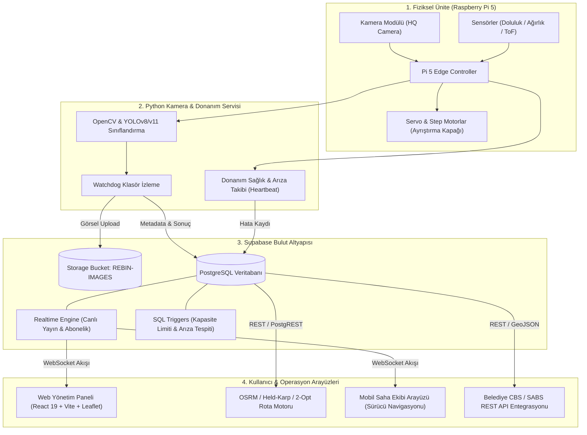
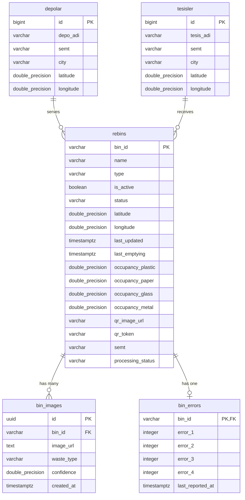

# Rebin - Entegre Akıllı Atık Yönetim Sistemi

[](LICENSE)
[](https://react.dev/)
[](https://vitejs.dev/)
[](https://supabase.com/)
[](https://www.python.org/)
[](https://www.raspberrypi.com/)
[](#12-sıfır-atık-standartları-ve-renk-kodları)

---

## İçindekiler
1. [Proje Özeti ve Mimari Bakış](#1-proje-özeti-ve-mimari-bakış)
   - [Projenin Tanımı](#11-projenin-tanımı)
   - [Sıfır Atık Standartları ve Renk Kodları](#12-sıfır-atık-standartları-ve-renk-kodları)
   - [Sistem Mimarisi Şeması](#13-sistem-mimarisi-şeması)
2. [Sistem Bileşenleri ve Ekran Fonksiyonları (Kullanıcı Kılavuzu)](#2-sistem-bileşenleri-ve-ekran-fonksiyonları-kullanıcı-kılavuzu)
   - [A. Fiziksel Ünite & Donanım Servisi (Raspberry Pi 5 / Python)](#a-fiziksel-ünite--donanım-servisi-raspberry-pi-5--python)
   - [B. Web Yönetim Paneli (YonetimPage & Harita & Kutular)](#b-web-yönetim-paneli-dashboard--yonetimpage)
   - [C. Mobil Saha & Yönetici Arayüzü](#c-mobil-saha--yönetici-arayüzü)
3. [Veritabanı Tasarımı ve Veri Modeli (Database Schema)](#3-veritabanı-tasarımı-ve-veri-modeli-database-schema)
   - [Varlık-İlişki ve Tablo Yapısı](#31-tablo-yapıları-ve-alan-tanımları)
   - [İş Mantığı ve Güvenlik Kuralları (Triggers & Functions)](#32-aktif-sql-tetikleyicileri-triggers)
   - [Storage ve RLS Güvenlik Politikaları](#33-depolama-storage-ve-rls-politikaları)
4. [Kamu Sistemleri ve REST/OGC API Entegrasyon Potansiyeli](#4-kamu-sistemleri-ve-restogc-api-entegrasyon-potansiyeli)
   - [Açık Standartlar ve Veri Formatları](#41-açık-standartlar-ve-veri-biçimleri)
   - [Belediye CBS ve Sıfır Atık Bilgi Sistemi (SABS) Entegrasyonu](#42-belediye-cbsgis-ve-sabs-entegrasyonu)
5. [Kurulum ve Çalıştırma Rehberi (Installation Guide)](#5-kurulum-ve-çalıştırma-rehberi-installation-guide)
   - [A. Donanım Servisi Kurulumu (Raspberry Pi)](#a-donanım-servisi-kurulumu-raspberry-pi-5)
   - [B. Web Yönetim Paneli Kurulumu](#b-web-yönetim-paneli-kurulumu)
6. [Kütüphaneler ve Lisanslar (Dependencies & Licensing)](#6-kütüphaneler-ve-lisanslar-dependencies--licensing)
7. [Demo Videosu ve Teknik Doküman Linkleri](#7-demo-videosu-ve-teknik-doküman-linkleri)

---

## 1. Proje Özeti ve Mimari Bakış

### 1.1 Projenin Tanımı
**Rebin**, kentsel ve kurumsal alanlarda geri dönüşüm verimliliğini maksimize etmek amacıyla geliştirilmiş uçtan uca **Entegre Akıllı Atık Yönetim Sistemidir**. Sistem; **Raspberry Pi 5** tabanlı fiziksel akıllı atık ayrıştırma ünitesi, derin öğrenme tabanlı kamera görüntü işleme servisi, **Supabase PostgreSQL** bulut omurgası, **OSRM / Held-Karp / 2-Opt** algoritmalarıyla donatılmış dinamik rota optimizasyonlu web kontrol merkezi ve saha ekipleri için geliştirilmiş mobil arayüzlerden oluşur.

Rebin; atığı kaynağında türüne göre (Plastik, Kağıt, Cam, Metal) otonom olarak sınıflandırır, mekanik kapak mekanizmasıyla doğru hazneye yönlendirir, doluluk verilerini anlık olarak buluta işler ve lojistik araç filosunun karbon ayak izini en aza indirecek dinamik toplama rotaları üretir.

---

### 1.2 Sıfır Atık Standartları ve Renk Kodları
Rebin, **T.C. Çevre, Şehircilik ve İklim Değişikliği Bakanlığı Sıfır Atık Yönetmeliği**'nde belirtilen standart atık piktogramları ve renk hiyerarşisiyle tam uyumlu çalışır. Proje arayüzlerinde ve fiziksel ünite yönlendirmelerinde kullanılan renk kodları:

| Atık Kategorisi | Resmi Renk Kodu | İkincil Zemin Tonu | Kullanım Alanı |
| :--- | :--- | :--- | :--- |
| **Plastik Atıklar** | `#1477D4` (Mavi) | `#EBF3FA` (Açık Mavi) | Plastik dairesel grafik, ikon ve hazne kartı |
| **Kağıt Atıklar** | `#FEB200` (Sarı / Turuncu) | `#FFFDE7` (Açık Sarı) | Kağıt dairesel grafik, ikon ve hazne kartı |
| **Cam Atıklar** | `#41A047` (Canlı Yeşil) | `#E8F5E9` (Açık Yeşil) | Cam dairesel grafik, buton ve hazne kartı |
| **Metal Atıklar** | `#EF524E` (Kırmızı / Pembe) | `#FFEBEE` (Açık Pembe) | Metal dairesel grafik, ikon ve hazne kartı |

---

### 1.3 Sistem Mimarisi Şeması



```text
+---------------------------------------------------------------------------------------+
|                                REBIN SISTEM MIMARISI                                  |
+---------------------------------------------------------------------------------------+
|  [Fiziksel Kutu: RPi 5]  -->  [YOLO & OpenCV]  -->  [Watchdog & Supabase-Py]         |
|             |                                                |                        |
|    Sensör & Step Motor                               Görsel & Doluluk Verisi          |
|             |                                                v                        |
|             +-------------------------------------> [Supabase Bulut]                  |
|                                                     - PostgreSQL (rebins, bin_errors) |
|                                                     - Realtime WebSocket              |
|                                                     - Storage (REBIN-IMAGES)          |
|                                                              |                        |
|       +------------------------------------------------------+                        |
|       |                                                      |                        |
|       v                                                      v                        |
|  [Web Dashboard (React 19)]                           [Mobil Saha Arayüzü]            |
|  - Canlı 3 Aşamalı Akış                               - Dinamik Rota Takibi           |
|  - Depolar / Tesisler Haritası                        - QR Kod Doğrulama              |
|  - Sağ Alt Filo Takip Konsolu                         - Saha Arıza Bildirimi          |
|  - Held-Karp Rota Optimizasyonu                       - Güvenli %10 Filtresi          |
+---------------------------------------------------------------------------------------+
```

---

## 2. Sistem Bileşenleri ve Ekran Fonksiyonları (Kullanıcı Kılavuzu)

### A. Fiziksel Ünite & Donanım Servisi (Raspberry Pi 5 / Python)
Fiziksel ünite, atığın atıldığı andan itibaren ayrıştırılıp güvenli veriye dönüştürülmesini sağlayan otonom donanım katmanıdır:

1. **OpenCV & YOLO Tabanlı Anlık Atık Sınıflandırma:**
   - Kutu giriş haznesine yerleştirilen optik sensör tetiklendiğinde yüksek çözünürlüklü kamera ile atık görüntüsü kaydedilir.
   - Eğitilmiş nesne tespit modeli (YOLO) görüntüyü analiz ederek atığı 4 sınıftan birine (`plastic`, `paper`, `glass`, `metal`) sınıflandırır ve güven skoru (`confidence: 0.0 - 1.0`) üretir.
2. **GPIO Motor & Mekanik Kapak Kontrolü:**
   - Model çıktısına göre Raspberry Pi GPIO pinleri üzerinden servo veya step motorlar tetiklenir.
   - Döner mekanik kanal veya flap sistemi atığı doğru hazneye yönlendirir.
3. **Watchdog Yerel Klasör İzleme & Supabase Storage Senkronizasyonu:**
   - `watchdog` kütüphanesi yerel depolama alanını milisaniyelik gecikmeyle dinler.
   - Yeni yakalanan atık fotoğrafı asenkron olarak Supabase Storage (`REBIN-IMAGES`) kovasına yüklenir; dönen public URL ve sınıflandırma metadataları `bin_images` tablosuna INSERT edilir.
4. **Donanım Sağlık Kontrolü (Heartbeat) & Arıza Kaydı:**
   - Belirli aralıklarla sensör yanıtları, motor durumları ve bağlantı kalitesi kontrol edilir (Daemon Heartbeat).
   - Mekanik sıkışma, sensör arızası veya optik kirlilik saptandığında otomatik olarak `bin_errors` tablosundaki ilgili sayaca (`error_1` - `error_4`) kayıt düşülür.

---

### B. Web Yönetim Paneli (Dashboard & YonetimPage)
Yöneticiler ve belediye operasyon ekipleri için hazırlanan web kontrol merkezi aşağıdaki kritik fonksiyonları barındırır:

1. **Canlı Durum Akışı (Realtime State Stream):**
   - **Bekleme (Waiting):** Kutu boşta ve yeni atık bekliyor durumundayken şık bir bekleme göstergesi sunar.
   - **Sınıflandırma Bekleniyor (Processing - CSS Spin):** Atık algılandığında ve yapay zeka çıkarımı sürerken akıcı CSS animasyonlu spin göstergesi ile sistemin çalıştığı kullanıcıya bildirilir.
   - **Sonuç Ekranı (Result):** Çıkarım tamamlandığında 10 saniyelik dairesel geri sayım başlar. Bu ekranda çekilen güncel atık fotoğrafı, tespit edilen kategori rozeti ve doğruluk oranı (`% Güven Skoru`) canlı olarak sergilenir.
2. **İnteraktif Harita & Tesis Entegrasyonu (`HaritaPage` & `YonetimPage`):**
   - **Depolar:** Supabase `depolar` tablosundan canlı çekilen lojistik kalkış noktaları mavi işaretçilerle (`#2563EB`) gösterilir.
   - **Tesisler:** `tesisler` tablosundan çekilen ana geri dönüşüm merkezleri yeşil işaretçilerle (`#7C3AED` / `#9333EA` / `#388E3C`) haritada konumlandırılır.
   - **Kutular:** Kutuların anlık doluluk durumlarına göre dinamik piktogramlar ve arıza bayrakları harita üzerinde render edilir.
3. **Bölgesel ve Semt Bazlı Filtreleme:**
   - Şehir bazında hızlı odaklanma (**İstanbul** / **Ankara** merkez koordinatları ve zoom düzeyleri).
   - Veritabanındaki `semt` kolonundan dinamik üretilen semt filtreleme menüsü sayesinde hedeflenen mahalle ve bölgeler anında süzülebilir.
4. **Filo Takip & Kontrol Paneli (Sağ Alt Widget):**
   - Yönetim sayfasının sağ alt köşesine sabitlenmiş, katlanabilir (minimize/maximize) bağımsız filo izleme konsolu.
   - OSRM matrisi ve Held-Karp / 2-Opt algoritmalarıyla optimize edilen araçların anlık harita üzerindeki hareketleri, kalan mesafe, tahmini varış süresi ve taşıma durumu bu konsoldan yönetilir.
5. **Arıza & Kapasite Yönetimi:**
   - Arıza bildirim sayacı pozitif olan kutular için sarı/kehribar temalı belirgin **"ARIZALI!"** uyarı kartı açılır.
   - Yönetici tek tıkla **"İlgili Birimi Görevlendir"** butonuna basarak arıza durumunu sıfırlayabilir ve saha ekiplerine bildirim yönlendirebilir.

---

### C. Mobil Saha & Yönetici Arayüzü
Saha toplama personeli ve şoförlerin kullandığı mobil arayüz:

1. **Bölge Bazlı Optimize Toplama Rotası:**
   - Şoförün bulunduğu depodan başlayan, kritik doluluktaki kutuları en kısa sürede toplayıp en yakın geri dönüşüm tesisine ulaştıran adım adım rota navigasyonu.
2. **Güvenli Doluluk Oranları (%10 Filtreli Veri):**
   - Hatalı ölçüm ve dik düşen atık dalgalanmalarından arındırılmış, veritabanı trigger korumalı net hacim oranları.
3. **Kutu QR Kod Doğrulama:**
   - Saha personeli kutu yanına vardığında kutu üzerindeki dinamik QR kodu taratarak boşaltım işlemini onaylar ve doluluk oranını sıfırlar.

---

## 3. Veritabanı Tasarımı ve Veri Modeli (Database Schema)

Sistem, **Supabase PostgreSQL** üzerinde ilişkisel veri bütünlüğü, row-level security (RLS) ve özel veritabanı tetikleyicileri ile kurgulanmıştır.



---

### 3.1 Tablo Yapıları ve Alan Tanımları

#### 1. `rebins` Tablosu (Ana Kutu Varlığı)
Akıllı kutuların operasyonel durumunu, anlık doluluklarını ve koordinatlarını tutar.
```sql
CREATE TABLE public.rebins (
    bin_id VARCHAR(64) PRIMARY KEY,
    name VARCHAR(128) NOT NULL,
    type VARCHAR(32) DEFAULT 'public', -- 'public' veya 'private'
    is_active BOOLEAN DEFAULT true,
    status VARCHAR(32) DEFAULT 'active', -- 'active', 'out_of_order'
    latitude DOUBLE PRECISION NOT NULL,
    longitude DOUBLE PRECISION NOT NULL,
    last_updated TIMESTAMPTZ DEFAULT timezone('utc'::text, now()),
    last_emptying TIMESTAMPTZ,
    occupancy_plastic DOUBLE PRECISION DEFAULT 0.0 CHECK (occupancy_plastic BETWEEN 0.0 AND 1.0),
    occupancy_paper DOUBLE PRECISION DEFAULT 0.0 CHECK (occupancy_paper BETWEEN 0.0 AND 1.0),
    occupancy_glass DOUBLE PRECISION DEFAULT 0.0 CHECK (occupancy_glass BETWEEN 0.0 AND 1.0),
    occupancy_metal DOUBLE PRECISION DEFAULT 0.0 CHECK (occupancy_metal BETWEEN 0.0 AND 1.0),
    qr_image_url TEXT,
    qr_token VARCHAR(128),
    semt VARCHAR(64),
    processing_status VARCHAR(32) DEFAULT 'waiting' -- 'waiting', 'processing', 'result'
);
```

#### 2. `bin_images` Tablosu (Atık Fotoğrafları ve Çıkarım Kayıtları)
```sql
CREATE TABLE public.bin_images (
    id UUID PRIMARY KEY DEFAULT gen_random_uuid(),
    bin_id VARCHAR(64) REFERENCES public.rebins(bin_id) ON DELETE CASCADE,
    image_url TEXT NOT NULL,
    waste_type VARCHAR(32) NOT NULL, -- 'plastic', 'paper', 'glass', 'metal'
    confidence DOUBLE PRECISION NOT NULL,
    created_at TIMESTAMPTZ DEFAULT timezone('utc'::text, now())
);
```

#### 3. `bin_errors` Tablosu (Donanım Arıza Sayaçları)
```sql
CREATE TABLE public.bin_errors (
    bin_id VARCHAR(64) PRIMARY KEY REFERENCES public.rebins(bin_id) ON DELETE CASCADE,
    error_1 INTEGER DEFAULT 0, -- Malzeme algılanmama hatası
    error_2 INTEGER DEFAULT 0, -- Sınıflandırma hatası
    error_3 INTEGER DEFAULT 0, -- Ayrıştırma/motor hatası
    error_4 INTEGER DEFAULT 0, -- Diğer donanım/sensör hataları
    last_reported_at TIMESTAMPTZ DEFAULT timezone('utc'::text, now())
);
```

#### 4. `depolar` ve `tesisler` Tabloları (Lojistik Altyapı)
```sql
CREATE TABLE public.depolar (
    id BIGSERIAL PRIMARY KEY,
    depo_adi VARCHAR(128) NOT NULL,
    semt VARCHAR(64) NOT NULL,
    city VARCHAR(64) NOT NULL,
    latitude DOUBLE PRECISION NOT NULL,
    longitude DOUBLE PRECISION NOT NULL
);

CREATE TABLE public.tesisler (
    id BIGSERIAL PRIMARY KEY,
    tesis_adi VARCHAR(128) NOT NULL,
    semt VARCHAR(64) NOT NULL,
    city VARCHAR(64) NOT NULL,
    latitude DOUBLE PRECISION NOT NULL,
    longitude DOUBLE PRECISION NOT NULL
);
```

---

### 3.2 Aktif SQL Tetikleyicileri (Triggers)

#### 1. Ani Kapasite Sıçramalarını Engelleyen Trigger (`check_capacity_increase_limit`)
Sensör önüne atığın dik düşmesi veya geçici hatalı okumalarda kapasitenin tek bir adımda mantıksız şekilde artmasını önler:
```sql
CREATE OR REPLACE FUNCTION public.validate_capacity_increase()
RETURNS TRIGGER AS $$
BEGIN
    -- Boşaltım işlemi (azalma) her zaman serbesttir
    -- Ancak tek ölçümde %10'dan (0.10) fazla artış sensör anomalisi sayılarak filtrelenir
    IF (NEW.occupancy_plastic > OLD.occupancy_plastic + 0.10) THEN
        NEW.occupancy_plastic := OLD.occupancy_plastic + 0.10;
    END IF;
    IF (NEW.occupancy_paper > OLD.occupancy_paper + 0.10) THEN
        NEW.occupancy_paper := OLD.occupancy_paper + 0.10;
    END IF;
    IF (NEW.occupancy_glass > OLD.occupancy_glass + 0.10) THEN
        NEW.occupancy_glass := OLD.occupancy_glass + 0.10;
    END IF;
    IF (NEW.occupancy_metal > OLD.occupancy_metal + 0.10) THEN
        NEW.occupancy_metal := OLD.occupancy_metal + 0.10;
    END IF;

    NEW.last_updated := now();
    RETURN NEW;
END;
$$ LANGUAGE plpgsql;

CREATE TRIGGER check_capacity_increase_limit
BEFORE UPDATE OF occupancy_plastic, occupancy_paper, occupancy_glass, occupancy_metal
ON public.rebins
FOR EACH ROW
EXECUTE FUNCTION public.validate_capacity_increase();
```

#### 2. Arıza Durumunda Otomatik Servis Dışı Bırakma (`update_bin_status_on_error`)
`bin_errors` tablosunda herhangi bir arıza sayacı 0'dan büyük olduğunda ilişkili kutuyu otomatik olarak `out_of_order` moduna alır:
```sql
CREATE OR REPLACE FUNCTION public.sync_bin_fault_status()
RETURNS TRIGGER AS $$
BEGIN
    IF (NEW.error_1 > 0 OR NEW.error_2 > 0 OR NEW.error_3 > 0 OR NEW.error_4 > 0) THEN
        UPDATE public.rebins SET status = 'out_of_order' WHERE bin_id = NEW.bin_id;
    ELSE
        UPDATE public.rebins SET status = 'active' WHERE bin_id = NEW.bin_id;
    END IF;
    RETURN NEW;
END;
$$ LANGUAGE plpgsql;

CREATE TRIGGER update_bin_status_on_error
AFTER INSERT OR UPDATE OF error_1, error_2, error_3, error_4
ON public.bin_errors
FOR EACH ROW
EXECUTE FUNCTION public.sync_bin_fault_status();
```

---

### 3.3 Depolama (Storage) ve RLS Politikaları
Supabase Storage üzerinde `REBIN-IMAGES` kovası oluşturulmuştur:
- **Allow Public Select:** Atık fotoğraflarının dashboard ve mobil arayüzlerde önizlenebilmesi için genel okuma erişimi açıktır.
- **Allow Public Insert:** Raspberry Pi donanım servisinin API key ile yeni yakalanan fotoğrafları yükleyebilmesi için güvenli yazma yetkisi tanımlanmıştır.

```sql
-- Storage RLS Politikası Örneği
CREATE POLICY "Allow Public Select on REBIN-IMAGES"
ON storage.objects FOR SELECT
USING (bucket_id = 'rebin-images');

CREATE POLICY "Allow Public Insert on REBIN-IMAGES"
ON storage.objects FOR INSERT
WITH CHECK (bucket_id = 'rebin-images');
```

---

## 4. Kamu Sistemleri ve REST/OGC API Entegrasyon Potansiyeli

Rebin mimarisi; yerel yönetimlerin mevcut Coğrafi Bilgi Sistemleri (CBS / GIS) ve kamu atık takip portalları ile çift yönlü veri alışverişi yapabilecek şekilde standartlaştırılmıştır.

### 4.1 Açık Standartlar ve Veri Biçimleri
- **JSON & GeoJSON Payload:** Tüm konum ve rota çıktıları OGC (Open Geospatial Consortium) standartlarında `Point`, `LineString` ve `FeatureCollection` formatında servis edilebilir.
- **WGS84 (EPSG:4326):** Küresel GPS koordinat standardı ile tam uyumluluk.
- **ISO 8601 Zaman Formatı:** Zaman damgaları UTC bazında `YYYY-MM-DDTHH:mm:ss.sssZ` formatında işlenir.

#### Örnek REST API Çıktısı (`GET /api/v1/bins/{bin_id}`)
```json
{
  "bin_id": "BIN-3401",
  "name": "Kadıköy Rıhtım Akıllı Ünite",
  "status": "active",
  "location": {
    "type": "Point",
    "coordinates": [29.0234, 40.9912],
    "crs": { "type": "name", "properties": { "name": "urn:ogc:def:crs:OGC:1.3:CRS84" } }
  },
  "occupancy": {
    "plastic": 0.74,
    "paper": 0.32,
    "glass": 0.58,
    "metal": 0.15,
    "average": 0.4475
  },
  "last_updated": "2026-09-11T14:35:10.000Z",
  "errors": {
    "has_fault": false,
    "total_error_count": 0
  }
}
```

### 4.2 Belediye CBS/GIS ve SABS Entegrasyonu
1. **Sıfır Atık Bilgi Sistemi (SABS) Uyumu:**
   - Çevre, Şehircilik ve İklim Değişikliği Bakanlığı Sıfır Atık Bilgi Sistemi'ne periyodik olarak toplanan atık cinsi ve hacim/ağırlık verileri otomatik aktarılabilir.
2. **Belediye Akıllı Kent Otomasyonu (OGC SensorThings / WFS):**
   - Belediye kriz ve operasyon merkezleri, Rebin verilerini WFS (Web Feature Service) veya REST API üzerinden doğrudan ArcGIS, Netcad, QGIS ve Kent Bilgi Sistemi (KBS) katmanlarına entegre edebilir.

---

## 5. Kurulum ve Çalıştırma Rehberi (Installation Guide)

### A. Donanım Servisi Kurulumu (Raspberry Pi 5)

#### 1. Gereksinimler
- Raspberry Pi OS (64-bit Bookworm önerilir)
- Python 3.10+ ve virtualenv
- Pi Camera Module v2 / v3 veya USB UVC Kamera

#### 2. Kurulum Adımları
```bash
# Depoyu klonlayın
git clone https://github.com/username/rebin.git
cd rebin/rebin-pi-service

# Python sanal ortamını oluşturun ve aktifleştirin
python3 -m venv venv
source venv/bin/activate

# Gerekli kütüphaneleri yükleyin
pip install --upgrade pip
pip install -r requirements.txt

# Çevre değişkenlerini hazırlayın (.env)
cat <<EOF > .env
SUPABASE_URL=https://spmyeaixfdiohkmmfvgu.supabase.co
SUPABASE_SERVICE_ROLE_KEY=your_service_role_or_anon_key
BIN_ID=BIN-0001
IMAGE_WATCH_DIR=/home/pi/rebin_captures
EOF

# Servisi test amaçlı başlatın
python main.py
```

#### 3. Arka Plan Servisi (systemd) Kurulumu: `rebin-tracker.service`
Servisin cihaz açıldığında otomatik başlaması için:
```bash
sudo nano /etc/systemd/system/rebin-tracker.service
```
Aşağıdaki içeriği yapıştırın:
```ini
[Unit]
Description=Rebin Raspberry Pi Smart Waste Tracking & AI Service
After=network.target

[Service]
Type=simple
User=pi
WorkingDirectory=/home/pi/rebin/rebin-pi-service
ExecStart=/home/pi/rebin/rebin-pi-service/venv/bin/python main.py
Restart=always
RestartSec=5
EnvironmentFile=/home/pi/rebin/rebin-pi-service/.env

[Install]
WantedBy=multi-user.target
```
Servisi etkinleştirin ve başlatın:
```bash
sudo systemctl daemon-reload
sudo systemctl enable rebin-tracker.service
sudo systemctl start rebin-tracker.service
sudo systemctl status rebin-tracker.service
```

---

### B. Web Yönetim Paneli Kurulumu

#### 1. Gereksinimler
- Node.js (v18.0.0 veya üstü)
- npm veya yarn / pnpm

#### 2. Kurulum ve Çalıştırma
```bash
# Web dizinine girin
cd rebin-web

# Bağımlılıkları yükleyin
npm install

# .env dosyasını oluşturun (veya mevcut config'i doğrulayın)
cat <<EOF > .env
VITE_SUPABASE_URL=https://spmyeaixfdiohkmmfvgu.supabase.co
VITE_SUPABASE_ANON_KEY=eyJhbGciOiJIUzI1NiIsInR5cCI6IkpXVCJ9...
EOF

# Geliştirici sunucusunu ayağa kaldırın
npm run dev
```
Uygulama varsayılan olarak `http://localhost:5173` adresinde çalışacaktır.

#### 3. Production Derlemesi
```bash
npm run build
npm run preview
```

---

## 6. Kütüphaneler ve Lisanslar (Dependencies & Licensing)

| Katman | Kütüphane / Teknoloji | Sürüm | Lisans | Kullanım Amacı |
| :--- | :--- | :--- | :--- | :--- |
| **Python / Pi** | `supabase-py` | `^2.x` | MIT | Supabase veritabanı ve storage istemcisi |
| **Python / Pi** | `watchdog` | `^3.x` | Apache 2.0 | Kamera yerel klasöründeki yeni görselleri izleme |
| **Python / Pi** | `opencv-python` | `^4.x` | Apache 2.0 | Görüntü yakalama ve ön işleme |
| **Python / Pi** | `RPi.GPIO` | `^0.7` | MIT | Servo ve motor mekanik kontrolü |
| **Python / Pi** | `ultralytics` (YOLO) | `^8.x` | AGPL-3.0 / Enterprise | Derin öğrenme atık tespit modeli |
| **Web Frontend** | `React` | `^19.2.8` | MIT | Reaktif kullanıcı arayüzü kütüphanesi |
| **Web Frontend** | `Vite` | `^8.2.2` | MIT | Yeni nesil hızlı build aracı |
| **Web Frontend** | `@supabase/supabase-js`| `^2.112.4`| MIT | Bulut veritabanı & Realtime WebSocket katmanı |
| **Web Frontend** | `leaflet` / `react-leaflet` | `^1.9 / ^5.0`| BSD-2-Clause | İnteraktif harita ve işaretçi yönetimi |
| **Web Frontend** | `lucide-react` | `^1.34.0` | ISC | Modern arayüz vektörel ikon seti |
| **Web Frontend** | `axios` | `^1.20.0` | MIT | OSRM rota API HTTP istekleri |
| **Web Frontend** | `@tailwindcss/postcss` | `^4.3.3` | MIT | Modern yardımcı sınıf tabanlı stil motoru |

### Lisans
Bu proje [MIT Lisansı](LICENSE) kapsamında açık kaynak olarak lisanslanmıştır.

---

## 7. Demo Videosu ve Teknik Doküman Linkleri

* **Demo Videosu Bağlantısı:** [YouTube / Google Drive Demo Videosu](https://www.youtube.com/)
* **Çalıştırılabilir Paket / APK:** [Releasable Package / Mobil APK](https://github.com/)
* **Canlı Web Dashboard:** [Rebin Canlı Yönetim Paneli](https://rebin-web.vercel.app/)
* **Proje Teknik Raporu:** [Teknik Şartname ve Jüri Değerlendirme Dosyası (PDF)](./docs/Rebin_Teknik_Rapor.pdf)

---

> **Not:** Rebin Akıllı Atık Yönetim Sistemi; yazılımı, gömülü sistem mimarisi, yapay zeka çıkarım pipeline'ı ve endüstriyel tasarımı ile tamamen yerli ve milli imkanlar hedeflenerek tasarlanmıştır.
